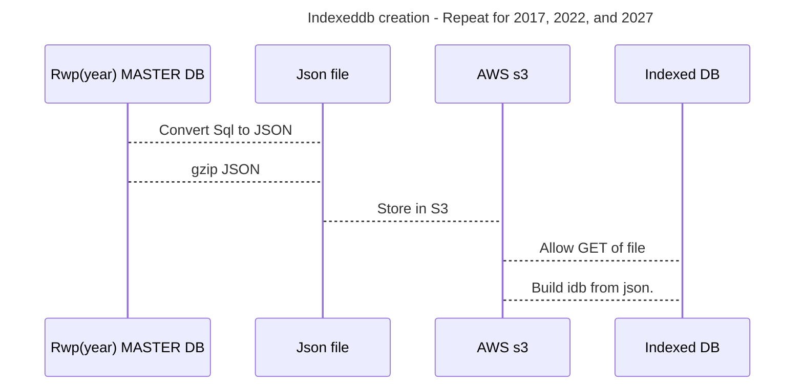

```mermaid
---
title: Indexeddb creation - Repeat for 2017, 2022, and 2027
---

sequenceDiagram
    Rwp(year) MASTER DB-->Json file: Convert Sql to JSON
    Rwp(year) MASTER DB-->Json file: gzip JSON


    Json file-->AWS s3: Store in S3 
    AWS s3-->Indexed DB: Allow GET of file
    AWS s3-->Indexed DB: Build idb from json.

```