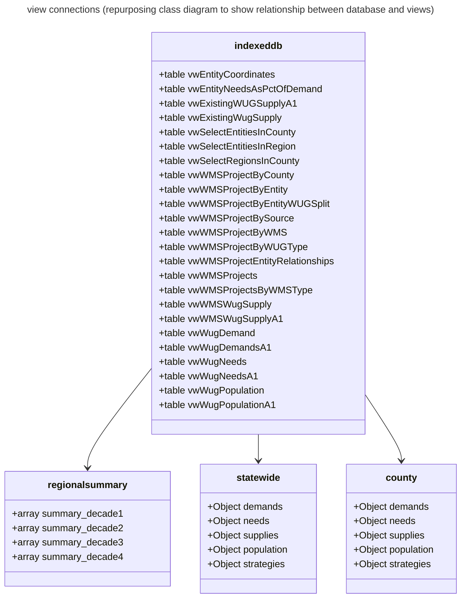

```mermaid
---
title: view connections (repurposing class diagram to show relationship between database and views)
---
classDiagram
    class indexeddb {
        +table vwEntityCoordinates
        +table vwEntityNeedsAsPctOfDemand
        +table vwExistingWUGSupplyA1
        +table vwExistingWugSupply
        +table vwSelectEntitiesInCounty
        +table vwSelectEntitiesInRegion
        +table vwSelectRegionsInCounty
        +table vwWMSProjectByCounty
        +table vwWMSProjectByEntity
        +table vwWMSProjectByEntityWUGSplit
        +table vwWMSProjectBySource
        +table vwWMSProjectByWMS
        +table vwWMSProjectByWUGType
        +table vwWMSProjectEntityRelationships
        +table vwWMSProjects
        +table vwWMSProjectsByWMSType
        +table vwWMSWugSupply
        +table vwWMSWugSupplyA1
        +table vwWugDemand
        +table vwWugDemandsA1
        +table vwWugNeeds
        +table vwWugNeedsA1
        +table vwWugPopulation
        +table vwWugPopulationA1
    }

    class regionalsummary {
        +array summary_decade1
        +array summary_decade2
        +array summary_decade3
        +array summary_decade4
    }

    class statewide {
        +Object demands
        +Object needs
        +Object supplies
        +Object population
        +Object strategies
    }

    class county {
        +Object demands
        +Object needs
        +Object supplies
        +Object population
        +Object strategies
    }
    
    indexeddb --> regionalsummary
    indexeddb --> statewide
    indexeddb --> county
```